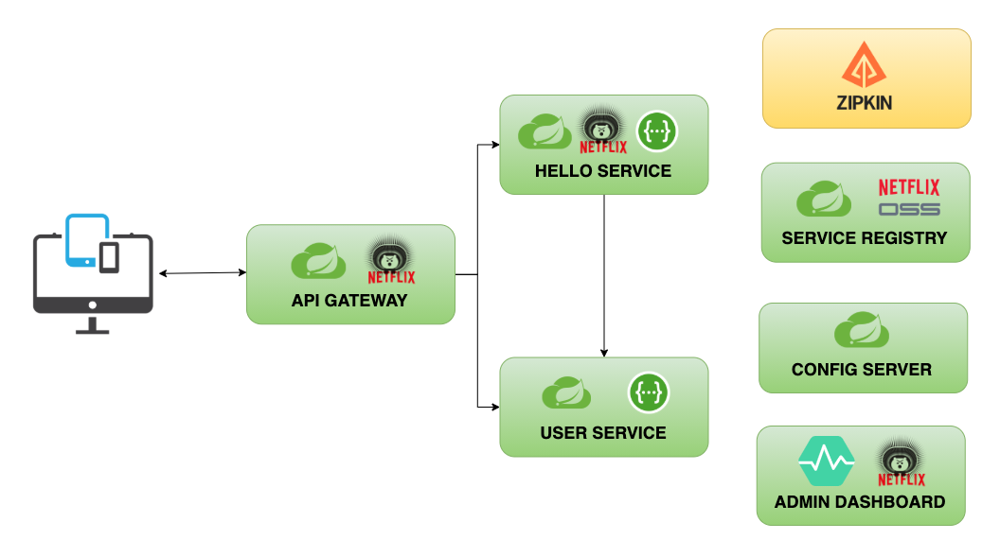

# Spring Cloud Netflix OSS Microservices (Demo)

Microservices demo using Netflix OSS and Spring Cloud frameworks. 

Patterns, technologies demonstrated here: 

* Service registry and discovery: Eureka.
* API gateway: Spring Cloud Gateway.
* Client side load balancing: Ribbon.
* Externalized configuration: Spring Cloud Config.
* Circuit breaker: Hystrix, Hystrix Dashboard.
* Distributed tracing: Sleuth, Zipkin.
* Monitoring: Spring Boot Admin.
* App Containerization: Docker, Docker Compose and Jib.

## Table of Content

- [Services](#services)
- [Architecture](#architecture)
- [Getting Started](#getting-started)
  * [Installation](#installation)
    + [Local](#local)
    + [Docker](#docker)
  * [Usage](#usage)
- [References](#references)
- [License](#license)

## Services

This demo consists of 7 different services:

1. [config-server](./applications/config-server)
2. [service-registry](./applications/service-registry)
3. [admin-dashboard](./applications/admin-dashboard)
4. [api-gateway](./applications/api-gateway)
5. [hello-service](./applications/services/hello-service)
6. [user-service](./applications/services/user-service)
7. zipkin


## Architecture



## Getting Started

### Installation

#### Local

Please refer to the individual readme files on instructions of how to run/build the services.

#### Docker

* You can build all docker images by running the `buildDockerImages.sh` on Mac/Linux systems or by going to each
  individual directory and following installation guide.

* Verify if all images exists, using `docker images | grep -w "com.rbiedrawa.cloud.microservices"` command.

     ```
    com.rbiedrawa.cloud.microservices/hello-service        0.0.1-SNAPSHOT
    com.rbiedrawa.cloud.microservices/user-service         0.0.1-SNAPSHOT 
    com.rbiedrawa.cloud.microservices/service-registry     0.0.1-SNAPSHOT 
    com.rbiedrawa.cloud.microservices/admin-dashboard      0.0.1-SNAPSHOT 
    com.rbiedrawa.cloud.microservices/config-server        0.0.1-SNAPSHOT 
    com.rbiedrawa.cloud.microservices/api-gateway          0.0.1-SNAPSHOT 
    ```
* Go to [docker](deployment/docker) subdirectory.

* Start zipkin and [config-server](./applications/config-server):

  `docker-compose up -d config-server zipkin`

* Start [service-registry](./applications/service-registry) and [admin-dashboard](./applications/admin-dashboard):

  `docker-compose up -d service-registry admin-dashboard`

* Start [api-gateway](./applications/api-gateway) and
  microservices ([hello-service](./applications/services/hello-service)
  , [user-service](./applications/services/user-service))

  `docker-compose up -d api-gateway hello-service user-service`

* Check if all containers are running, using `docker-compose ps` command.

   ```shell
   # Sample output
  
        Name                    Command                  State                    Ports              
  ---------------------------------------------------------------------------------------------------
  admin-dashboard    java -cp /app/resources:/a ...   Up             0.0.0.0:8085->8085/tcp          
  api-gateway        java -cp /app/resources:/a ...   Up             0.0.0.0:8082->8082/tcp          
  config-server      java -cp /app/resources:/a ...   Up             0.0.0.0:8888->8888/tcp          
  hello-service      java -cp /app/resources:/a ...   Up             0.0.0.0:8080->8080/tcp          
  service-registry   java -cp /app/resources:/a ...   Up             0.0.0.0:8761->8761/tcp          
  user-service       java -cp /app/resources:/a ...   Up             0.0.0.0:8081->8081/tcp          
  zipkin             start-zipkin                     Up (healthy)   9410/tcp, 0.0.0.0:9411->9411/tcp
   ```

### Usage

* Start services.

* Generate some traffic using `./applications/api-gateway/simulate-api-gateway-traffic.sh ` shell script or by going to individual api gateway enpoints.

* Visit Zipkin, spring boot admin, eureka and hystrix dashboard.

* More details can be found in individual readme files (Usage section).

## References

* [Spring Cloud Netflix](https://spring.io/projects/spring-cloud-netflix)

## License

Distributed under the MIT License. See `LICENSE` for more information.