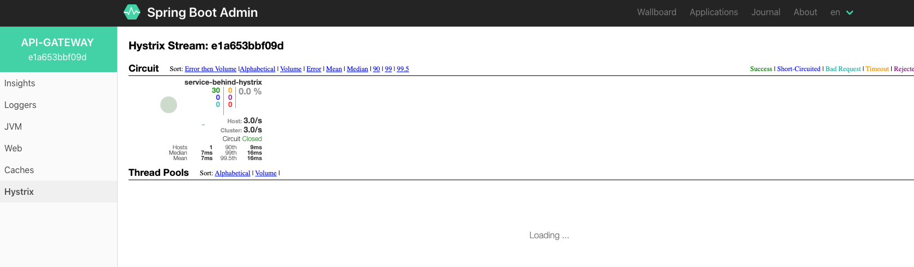
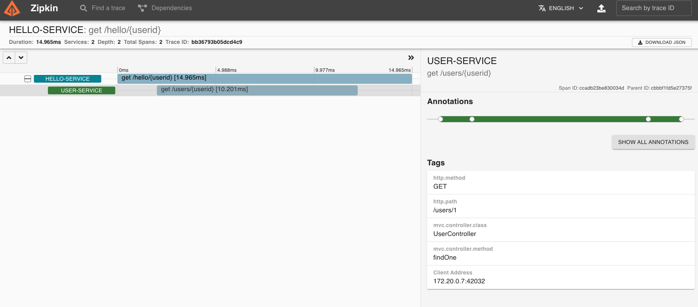

# Api Gateway

API Gateway for microservices that provides a simple way to route to APIs.

Additional integrations done:

* Circuit Breaker (Hystrix)
* Discovery Client (Ribbon, Eureka)
* Reactive

## Getting Started

### Prerequisite

* Running [config-server](../config-server).
* Running [service-registry](../service-registry).
* Running [zipkin](../..) server.doc
* Running [admin-dashboard](../admin-dashboard).
* Running [user-service](../services/user-service).
* Running [hello-service](../services/hello-service).

### Installation

Start application:

```
./gradlew bootRun
```

### Usage

* Start service.

* Check [available routes](http://localhost:8082/actuator/gateway/routes) in Api Gateway.

* Check if application successfully registered in [service-registry](http://localhost:8761/).

* Check load balancing.
  ```shell
  # Hello service
  curl "http://localhost:8082/api/v1/hello"
  
  # Users service    
  curl "http://localhost:8082/api/v1/usersusers"
  
  # Hystrix protecting custom route (Example how to use hystrix api in route definition, see RouteConfiguration.java)
  curl "http://localhost:8082/api/v1/hystrix/hello"
  
  # Simulate hystrix failure
  curl "http://localhost:8082/api/v1/hello/hystrix?shouldFail=true"
  
  # Simulate hystrix success
  curl "http://localhost:8082/api/v1/hello/hystrix?shouldFail=false"
  ```

* Check Hystrix dashboard:
    * Go to [admin-dashboard](http://localhost:8085/applications).
    * Choose 'api-gateway' application.
    * Click 'Hystrix' tab and see visualized hystrix stream e.g.
      

* Open [zipkin ui](http://localhost:9411/zipkin/) and investigate traces.
  

### Build

```
# Clean build jar
./gradlew clean build

# Build docker image
./gradlew jibDockerBuild
```

## Important Endpoints

| Name | Endpoint | 
| -------------:|:--------:|
| `Api Gateway` | http://localhost:8082/ |
| `Api Gateway - available routes` | http://localhost:8082/actuator/gateway/routes |
| `Api Gateway - Hello service ` | http://localhost:8082/api/v1/hello |
| `Api Gateway - Users service ` | http://localhost:8082/api/v1/users |
| `Api Gateway - Custom route behind hystrix using route definition, see RouteConfiguration.java:22` | http://localhost:8082/api/v1/hystrix/hello |
| `Api Gateway - Simulate hystrix error in Hello Service` | http://localhost:8082/api/v1/hello/hystrix?shouldFail=true |
| `Api Gateway - Simulate hystrix success in Hello Service` | http://localhost:8082/api/v1/hello/hystrix?shouldFail=false |


