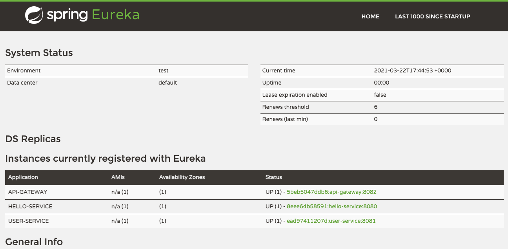

# Service Registry

Eureka Server application that holds the information about all client-service applications.

Eureka is the Netflix Service Discovery Server and Client, that can be configured and deployed to be highly available,
with each server replicating state about the registered services to the others.

Service Discovery is one of the key tenets of a microservice based architecture. Trying to hand configure each client,
or some form of convention can be very difficult to do and can be very brittle.

## Getting Started

### Prerequisite

* Running [config-server](../config-server).

### Installation

Start application:

```
./gradlew bootRun
```

### Usage

* Start service.

* Open [service-registry web ui](http://localhost:8761/).
    
### Build

```
# Clean build jar
./gradlew clean build

# Build docker image
./gradlew jibDockerBuild
```

## Important Endpoints

| Name | Endpoint | 
| -------------:|:--------:|
| `Service Registry` | http://localhost:8761/ |
